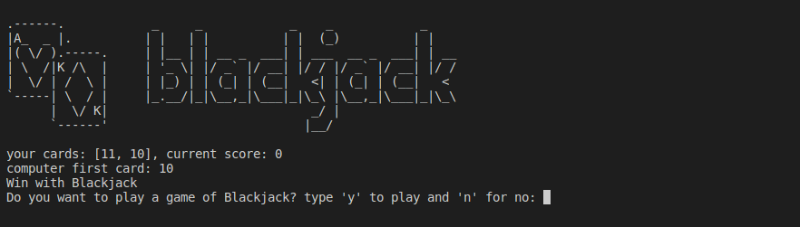

# Day11_Capstone_Black_jack
A game of black jack
# Day2

## Lessons learned today

- Data types
```
"strings" numbers boolean
```
- Type conversions
```
int("4") str(5) float(4)
```

- Operations

- f-strings
```
name = 'Kingdreamerr'
print(f"hello {name} !") 
```

- Conditional Statements
```
if elif and else
```
- Logical operators
```
>, >= <, <= and, or, not
```

- Code blocks and scopes

- Functions

- Functions with inputs and outputs

- while loops 
- for loops 
- for in range loops
- etc

## Project to solidify material learned 

### Game of BlackJack:
> This is a program that imitates the game BlackJack.

#### Preview:



## How to run this on your device

- Clone this repository
```
git clone https://github.com/kingdreamerr/Day11_Capstone_Black_jack.git
```
- cd into the repo
```
cd Day11_Capstone_Black_jack
```

- Paste the following in the terminal 
```
python3 main.py
```